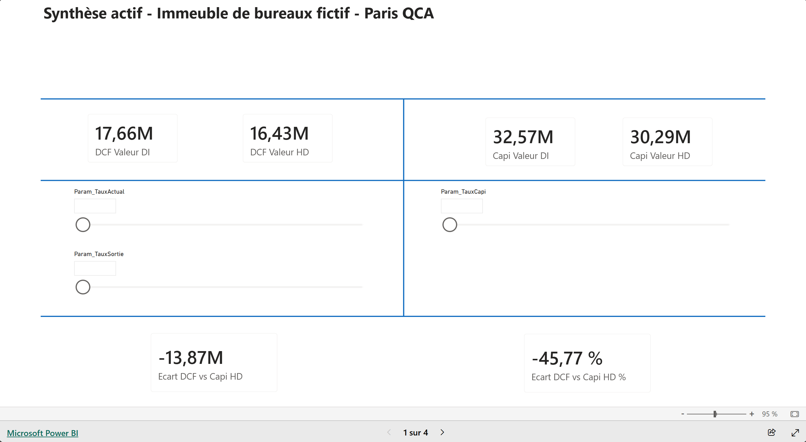
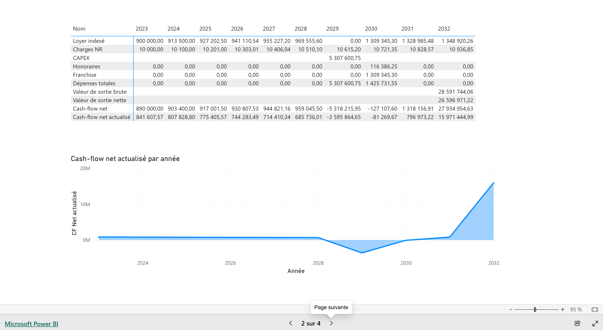
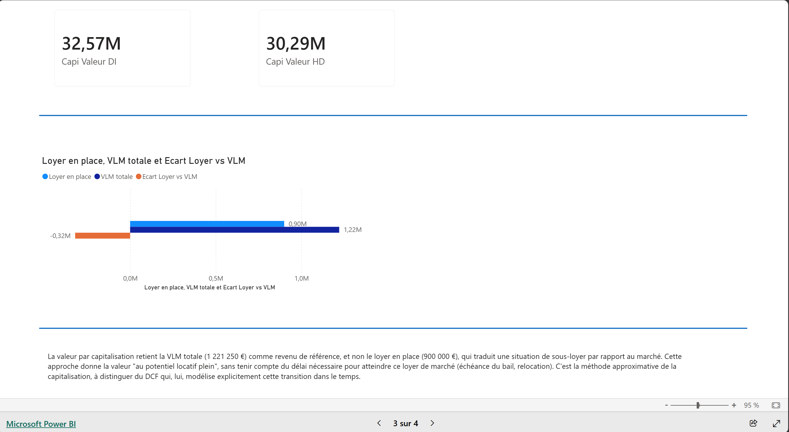
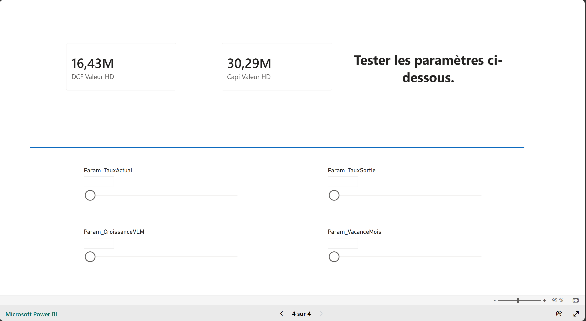

# Valo_V1 — Outil de valorisation immobilière (Power BI)

Outil d'expertise immobilière orienté **valeur vénale**, construit sous Power BI, inspiré d'un cas d'étude. Ce projet reproduit et pilote de façon interactive les deux méthodes classiques de valorisation d'un actif de bureaux : **DCF (discounted cash-flow)** et **capitalisation du revenu**.

**Données** : le jeu de données utilisé ici reprend la structure d'un cas d'étude pédagogique Immeuble Paris QCA, entièrement anonymisé. Aucune donnée client ou de mandat réel n'apparaît dans ce repo. Le fichier `.pbix` n'est volontairement pas publié dans ce dépôt.

**Démo interactive** : [Ouvrir le rapport Power BI en direct](https://app.powerbi.com/view?r=eyJrIjoiNGRkYmE4YmEtZmI0Zi00MTAzLTk0YmQtOTJlOGU2YzEyMTc4IiwidCI6ImQwNzYyZjgyLWU0MWQtNGZjOC1iZWFjLTBmYzYxMzY4NjE5NSJ9) — tous les sliders sont pilotables en direct, aucune connexion requise.

## Objectif

Ce n'est pas un modèle investisseur (pas d'IS, pas d'amortissement, pas de TRI). C'est un outil d'expertise qui détermine une valeur vénale, avec des hypothèses pilotables en direct (curseurs) pour tester la sensibilité de la valeur aux principaux paramètres de marché.

## Méthodes modélisées

**DCF (Discounted Cash-Flow)**
Projection année par année sur l'horizon défini (10 ans), intégrant :
- le bail en place (loyer, échéance) ;
- la vacance locative et la relocation à la valeur locative de marché (VLM) ;
- la franchise de loyer accordée au nouveau preneur ;
- les honoraires de commercialisation ;
- les charges non récupérables ;
- le CAPEX (travaux), indexé ;
- l'actualisation des flux au taux d'actualisation ;
- la valeur de sortie (valeur terminale), calculée par capitalisation du dernier loyer au taux de sortie, puis nette des frais de sortie.

**Capitalisation**
Valorisation directe du revenu locatif de marché (VLM) au taux de capitalisation, avec une note méthodologique sur l'écart entre loyer en place et VLM (sous/sur-loyer).

Les deux méthodes convertissent leur résultat en valeur Droits Inclus (DI) et Hors Droits (HD) : `HD = DI / (1 + frais d'acquisition)`.

## Structure du modèle

- **Lots** — décomposition de la surface louable (bureaux, archives, parkings) et VLM unitaire par lot.
- **Baux** — bail(s) en place (preneur, dates, loyer, charges non récupérables).
- **Evenements** — événements de type CAPEX (montant, année relative, indexation).
- **Reference** — table centralisant toutes les valeurs par défaut des hypothèses (taux, indexations, délais), utilisée comme filet de sécurité par les mesures.
- **Param_X** (paramètres Power BI "what-if") — un paramètre par hypothèse pilotable via curseur (taux d'actualisation, taux de sortie, taux de capitalisation, vacance, franchise, croissance VLM, honoraires, etc.).
- **Mesures** — l'ensemble des mesures DAX du moteur, organisées en dossiers `Paramètre`, `Hypothèses`, `Données`, `Valorisation`.
- **LignesCF** — table technique listant les lignes du cash-flow affichées dans la matrice de la page DCF, triées par un ordre explicite.
- **TECH_Annees_CF** — table technique des années de projection, utilisée en axe des visuels de cash-flow.

### Logique des hypothèses

Chaque hypothèse (ex. `Hyp Taux actualisation`) suit une priorité en cascade :
1. la valeur sélectionnée sur le curseur (`Param_X`), si l'utilisateur l'a modifiée ;
2. sinon, la valeur par défaut stockée dans la table `Reference`.

Cela permet de garder une source unique de vérité pour les valeurs par défaut, tout en laissant l'expert piloter chaque hypothèse en direct pendant une démonstration.

## Pages du rapport

1. **Synthèse actif** — valeurs DCF et Capitalisation (DI/HD), écart entre les deux méthodes, curseurs des taux principaux.

   

2. **DCF** — matrice des cash-flows annuels (loyer indexé, charges, CAPEX, honoraires, franchise, valeur de sortie, cash-flow net et actualisé) et graphique de la trajectoire du cash-flow net actualisé.

   

3. **Capitalisation** — valeurs DI/HD, comparaison loyer en place vs VLM, note méthodologique.

   

4. **Sensibilités** — valeurs DCF/Capitalisation HD et curseurs des hypothèses clés (taux d'actualisation, taux de sortie, croissance VLM, vacance) pour tester leur impact en direct.

   

## Étapes de validation

Le moteur DCF et Capitalisation a été validé au centime près contre le fichier Excel de référence, sur les quatre valeurs de synthèse ainsi que sur le détail annuel des cash-flows.

## Ce que cette V1 ne fait pas (volontairement)

- Pas de connexion SQL / historisation des scénarios (bouton de sauvegarde désactivé).
- Pas de scénarios multiples persistants (Base / Upside / Downside).
- Pas de couche d'interprétation par IA/LLM.
- Un seul actif (pas de portefeuille).

Ces éléments sont prévus pour une V2, une fois cette V1 gelée et documentée.

## Auteur

Julien Anceaux — projet personnel 
